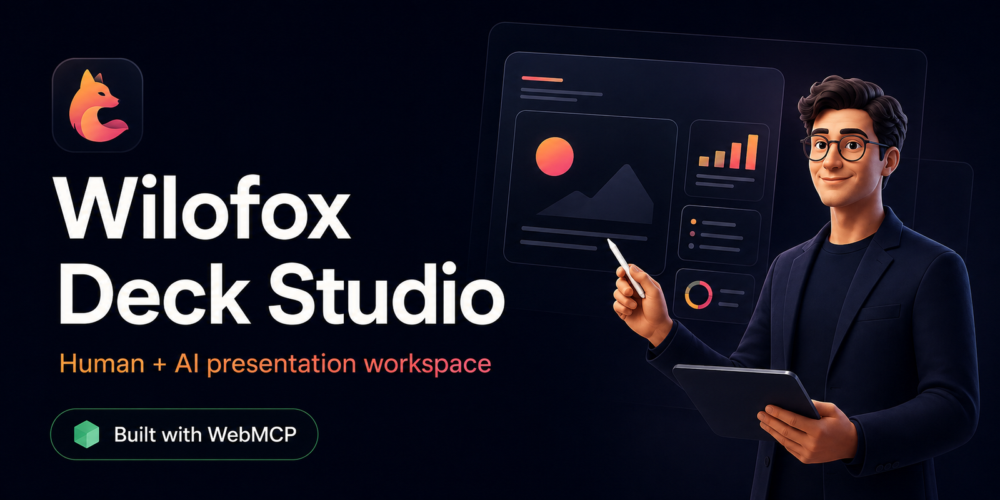
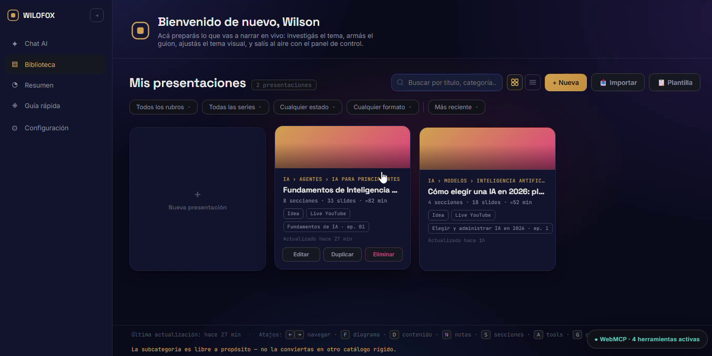
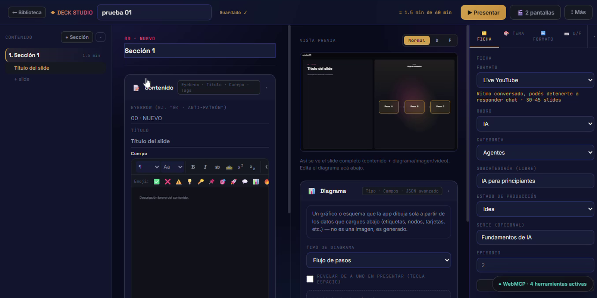
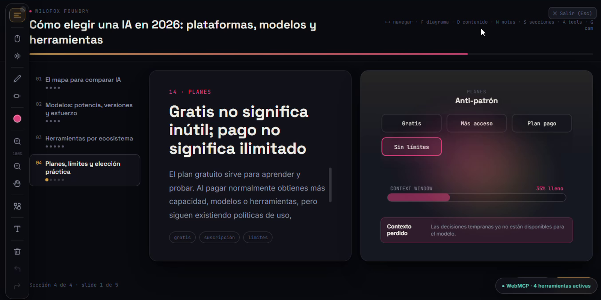
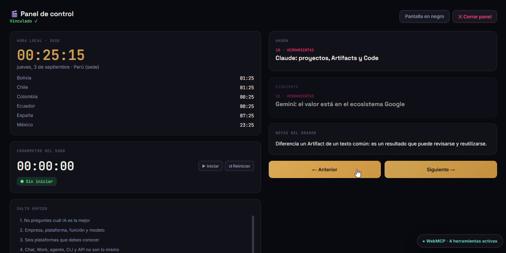
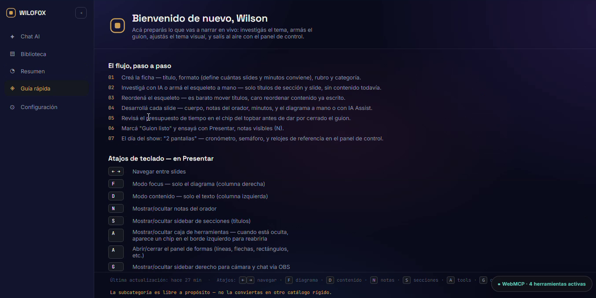

# Wilofox Deck Studio

<!-- WILOFOX-HERO -->

> Create and present visual lessons with an AI agent by your side, while the educator remains in control.

[Live Demo](https://wilofox-agentic-deck-studio.wilsonlavio9.chatgpt.site/) |
[Devpost Submission](https://devpost.com/software/wilofox-deck-studio) |
[Video Demo](https://youtu.be/XSbsEmCxs6Q)

## Why I built it

I created Wilofox Deck Studio because I needed one workspace for preparing visual lessons, presenting them on the web, teaching through live streams, and controlling content across multiple screens.

## What it does

Wilofox Deck Studio helps educators and content creators:

- Organize presentations into sections and slides.
- Combine written content with diagrams, images, and videos.
- Use speaker notes, timers, pointers, and annotation tools.
- Present with synchronized audience and presenter screens.
- Collaborate with an AI agent through WebMCP.
- Personalize the dashboard with an optional browser-local profile or continue as a guest.

## WebMCP integration

The application exposes four structured tools:

| Tool | Purpose |
|---|---|
| `create_deck` | Creates a complete editable presentation |
| `get_deck_context` | Reads the latest state, including human edits |
| `update_slide` | Updates one slide while preserving the others |
| `navigate_to_slide` | Opens a requested slide for review |

Agent actions use the same visible interface and application state as the educator.

## Try the WebMCP workflow

1. Open the [live application](https://wilofox-agentic-deck-studio.wilsonlavio9.chatgpt.site/).
2. Use ChatGPT's in-app browser or Chrome with WebMCP enabled.
3. Ask the agent to create or read a presentation.
4. Manually edit one slide.
5. Ask the agent to read the updated state and improve only that slide.

No account or credentials are required. The optional local profile only personalizes the current browser; it is not authentication and does not synchronize decks.

## Technology

- HTML5
- CSS3
- Vanilla JavaScript
- IndexedDB
- WebMCP
- OpenAI Codex

## Architecture

The application uses a portable single-file architecture. WebMCP is implemented as a progressive enhancement, so the manual presentation experience continues working in browsers without WebMCP support.

## Author

Created by Wilson Lavio for the OpenAI WebMCP Challenge.

## License

MIT License

<!-- WILOFOX-DOCUMENTATION -->

## Documentation

- [Quick Start](docs/QUICK_START.md)
- [User Guide](docs/USER_GUIDE.md)
- [Local Profile](docs/LOCAL_PROFILE.md)
- [WebMCP Guide](docs/WEBMCP_GUIDE.md)
- [Judge Guide](docs/JUDGE_GUIDE.md)
- [Architecture](docs/ARCHITECTURE.md)
- [Troubleshooting](docs/TROUBLESHOOTING.md)

<!-- WILOFOX-VISUAL-TOUR -->

## Visual Tour

### Presentation library

Organize, search, create, import, and manage presentations from one visual library.

### Structured editor

Build lessons with sections, editable content, diagrams, live previews, and presentation settings.

### Audience presentation mode

Present visual lessons progressively with navigation, diagrams, pointers, and annotation tools.

### Presenter control panel

Manage the current slide, upcoming content, speaker notes, timer, navigation, and audience screen.

### WebMCP readiness

The application successfully registers four structured WebMCP tools for compatible AI agents.
